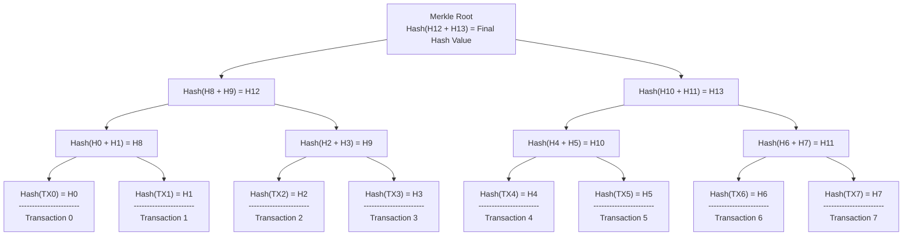
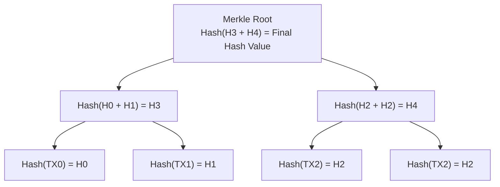

# Description
Implement Merkle Tree in C


# Usage
## Terminal
```bash
cd ./MerkleTree/src/

make

./merkletree InputArgument0 InputArgument1 InputArgument2 ...
```
## C
``` C
#include "merkletree.h"

char *InputWord[] = {"Example1", "Example2", "Example3"};
Init_MerkleTree(InputWord);
Print_MerkleHash_Postorder(root);
```


# Links
[Reference-Document](https://ko.wikipedia.org/wiki/%ED%95%B4%EC%8B%9C_%ED%8A%B8%EB%A6%AC)


# Merkle Tree Structure
## Example Merkle Tree Structure Diagram for Depth 3

- Example Merkle Tree Structure Diagram when Input is {TX0, TX1, TX2, TX3}

- Example Merkle Tree Structure Diagram when Input is {TX0, TX1, TX2}

